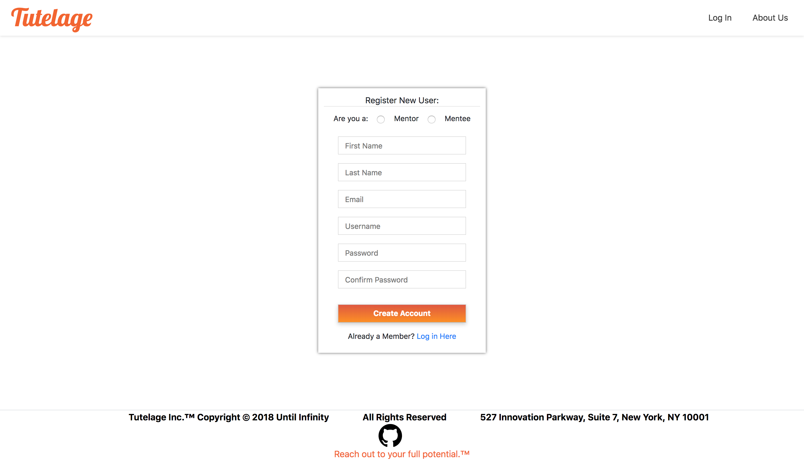
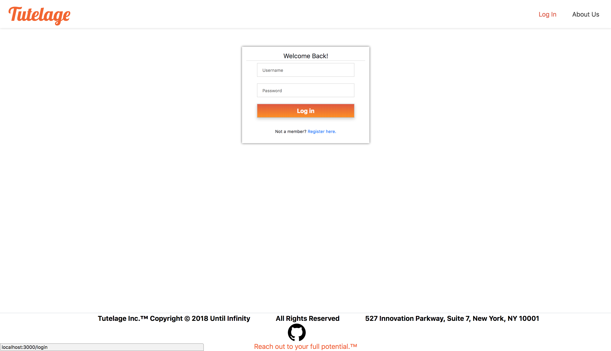
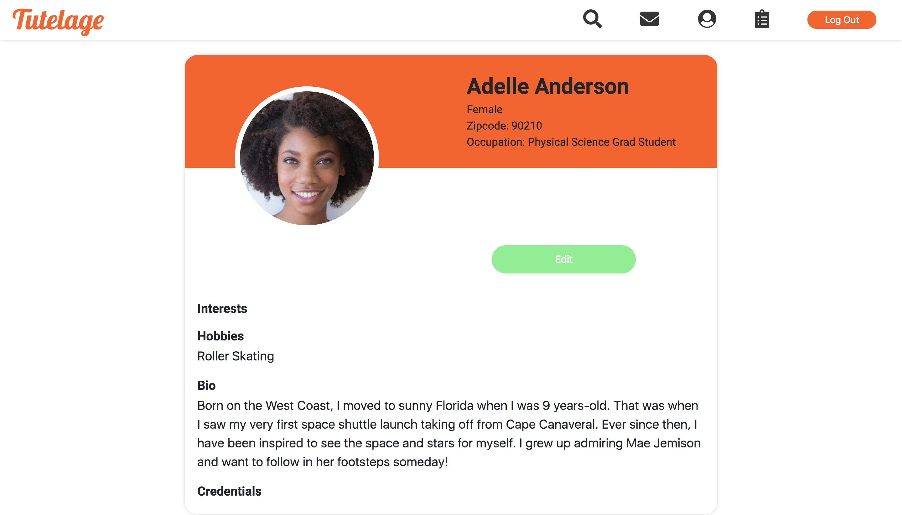

## Tutelage

## Description

Tutelage is a web application that allows individuals to find mentorship in a career field of their choosing from experienced experts.

## How does it work?

Tutelage works by allowing a "mentor" and a "mentee" to sign up for their accounts, respectively. Utilizing a matching algorithm, a mentee is paired with an ideal mentor to form a long-term, professional, mentoring relationship that will enrich the mentee's career path.

## How to run "Tutelage" locally:

##Technologies

Backend

* [BCrypt](https://github.com/shaneGirish/bcrypt-nodejs)
* [Node.js](https://nodejs.org/en/)
* [Postgres](https://postgresapp.com/)

Frontend

* [CSS]()
* [HTML]()
* [React.js](https://reactjs.org/)
* [React Router](https://www.npmjs.com/package/react-router)
* [React Bootstrap](https://react-bootstrap.github.io/components/carousel/)

## Credits

* [Gerson Castillo, Technical Lead](https://github.com/Acostill)
* [Nick Chavez, Scrum Master](https://github.com/nickst3r610)
* [Gregory Davis, Product Manager](https://github.com/davisgreg1)
* [Eddie Harmon, Demo Lead](https://github.com/EddieHarmonJr)
* [Carolina Restrepo, Design Lead](https://github.com/crestrepo12)